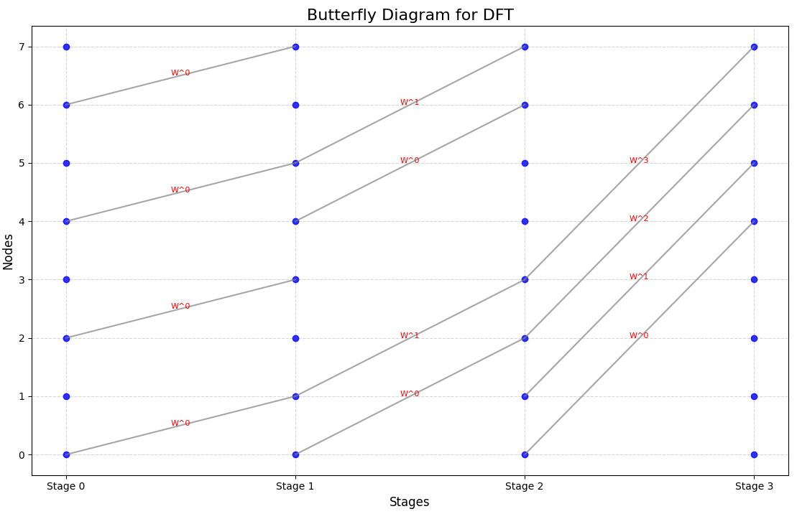

# DFT & DTT Visualiztation of FFT

### Choose DFT or DTT & get your Visualiztation result

## Code:-

```bash
import numpy as np
import matplotlib.pyplot as plt

def butterfly_diagram(input_signal, transform_type="DFT"):
    """
    Visualizes the butterfly diagram for DFT/FFT and displays results.

    Args:
        input_signal (np.ndarray): The input signal array.
        transform_type (str): "DFT" or "DTT" for the respective transform.
    """
    N = len(input_signal)
    stages = int(np.log2(N))

    if transform_type == "DFT":
        
        output_signal = np.fft.fft(input_signal)
    elif transform_type == "DTT":
       
        output_signal = np.real(np.fft.fft(input_signal))  
    else:
        raise ValueError("transform_type must be 'DFT' or 'DTT'")

    
    print("\nInput Signal:")
    print(input_signal)
    print(f"\nOutput Signal ({transform_type} Results):")
    print(output_signal)

    
    butterfly_connections = []
    weights = []
    for stage in range(stages):
        step = 2 ** (stage + 1)
        half_step = step // 2
        for k in range(0, N, step):
            for j in range(half_step):
                start = k + j
                end = k + j + half_step
                butterfly_connections.append((start, end))
                weights.append(f"W^{j}")

    
    fig, ax = plt.subplots(figsize=(14, 8))
    x_positions = np.linspace(0, stages, stages + 1)
    y_positions = np.arange(N)

    
    for stage in range(stages + 1):
        for n in range(N):
            ax.plot(x_positions[stage], y_positions[n], 'o', color='blue', alpha=0.8)

   
    weight_index = 0
    for stage in range(stages):
        step = 2 ** (stage + 1)
        half_step = step // 2
        for k in range(0, N, step):
            for j in range(half_step):
                start = k + j
                end = k + j + half_step
                ax.plot(
                    [x_positions[stage], x_positions[stage + 1]],
                    [y_positions[start], y_positions[end]],
                    color='gray', alpha=0.7
                )
                
                mid_x = (x_positions[stage] + x_positions[stage + 1]) / 2
                mid_y = (y_positions[start] + y_positions[end]) / 2
                ax.text(mid_x, mid_y, weights[weight_index], fontsize=8, color='red', ha='center')
                weight_index += 1

    
    ax.set_title(f"Butterfly Diagram for {transform_type}", fontsize=16)
    ax.set_xlabel("Stages", fontsize=12)
    ax.set_ylabel("Nodes", fontsize=12)
    ax.set_xticks(x_positions)
    ax.set_xticklabels([f"Stage {i}" for i in range(stages + 1)])
    ax.set_yticks(y_positions)
    ax.grid(visible=True, which='both', linestyle='--', alpha=0.5)
    plt.tight_layout()
    plt.show()


try:
    transform_type = input("Enter the transform type (DFT or DTT): ").strip().upper()
    if transform_type not in ["DFT", "DTT"]:
        raise ValueError("Invalid transform type. Please enter 'DFT' or 'DTT'.")

    N = int(input("Enter the number of data points (must be a power of 2): "))
    if not (N > 0 and (N & (N - 1)) == 0):
        raise ValueError("Number of data points must be a power of 2.")

    input_signal = []
    print(f"Enter {N} data points:")
    for i in range(N):
        value = float(input(f"Data point {i + 1}: "))
        input_signal.append(value)

    input_signal = np.array(input_signal)
    butterfly_diagram(input_signal, transform_type=transform_type)

except Exception as e:
    print(f"Error: {e}")

```
## Terminal

```bash
Enter the transform type (DFT or DTT): DFT
Enter the number of data points (must be a power of 2): 8
Enter 8 data points:
Data point 1: 1
Data point 2: 1
Data point 3: 1
Data point 4: 1
Data point 5: 2
Data point 6: 2
Data point 7: 2
Data point 8: 2

Input Signal:
[1. 1. 1. 1. 2. 2. 2. 2.]

Output Signal (DFT Results):
[12.+0.j         -1.+2.41421356j  0.+0.j         -1.+0.41421356j
  0.+0.j         -1.-0.41421356j  0.+0.j         -1.-2.41421356j]
```


## Visualiztation





